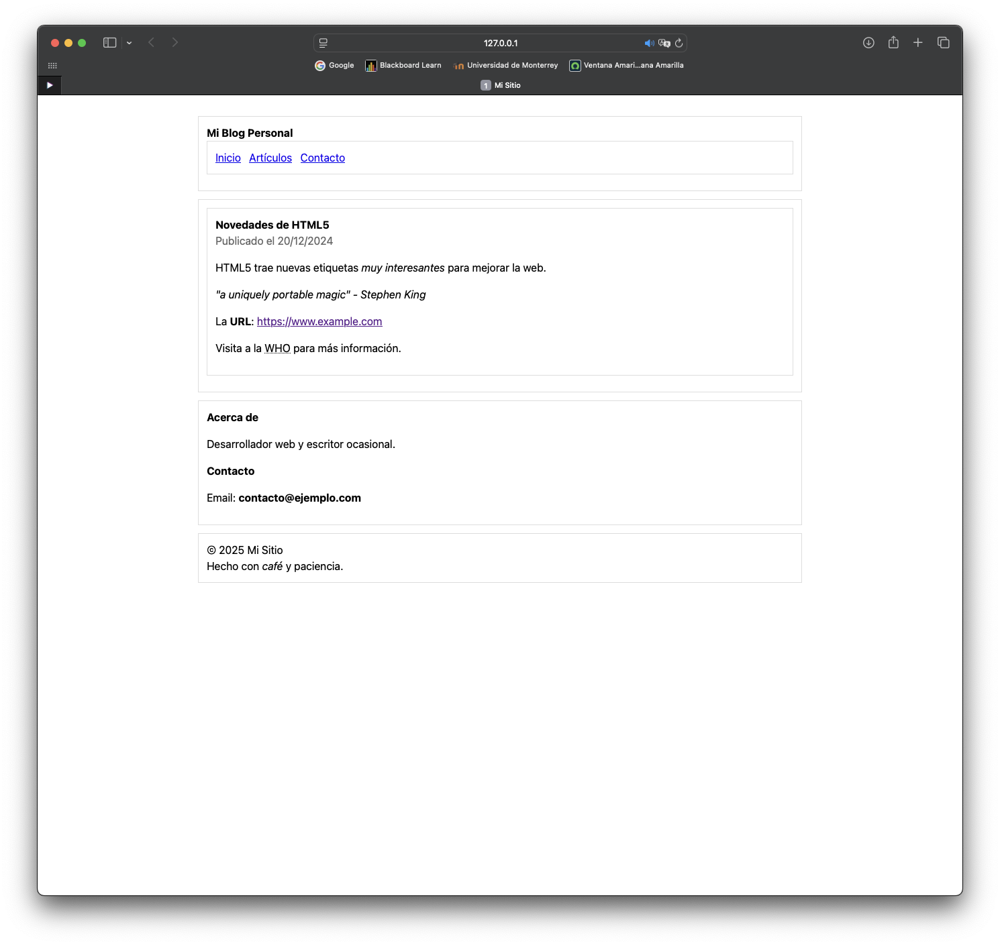
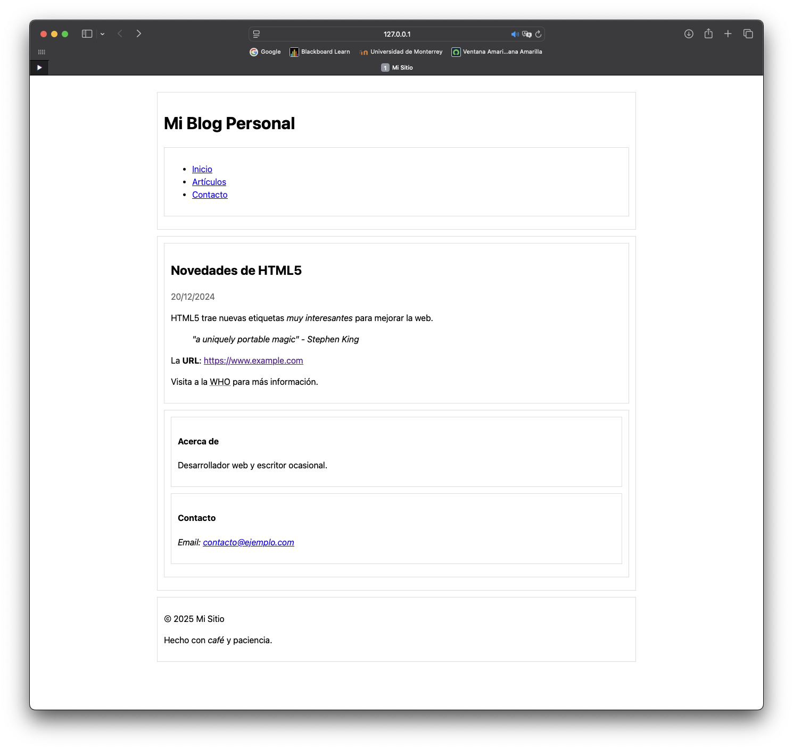
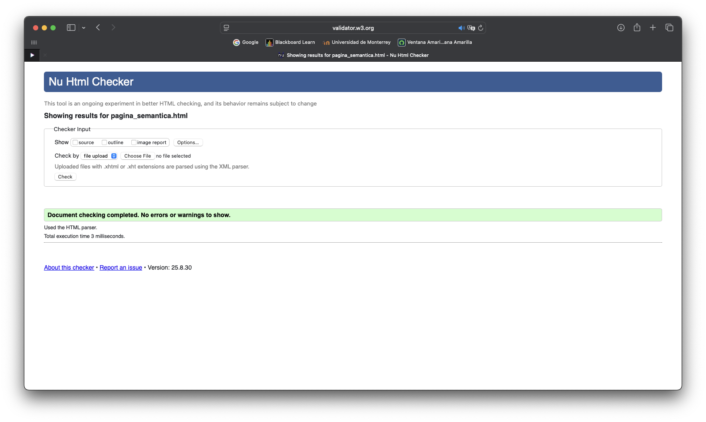

# M2A3_596749
Actividad M2A3: De &lt;div> a HTML Semántico + Validación W3C

---

<table>
    <tr>
        <td>
            
Página Base con &lt;div&gt;

            
        </td>
        <td>
            
Página Semántica

            
        <td>
    </tr>
</table>

Validación con W3C

---

## pagina_semantica.html
### Cambios de *pagina_base.html* a *pagina_semantica.html*:
- *&lt;style>*: Cambios de los tags:
    - *.header* **->** *header*
    - *.menu* **->** *nav*
    - *.content* **->** *main*
    - *.sidebar* **->** *aside*
    - *.post* **->** *article*
    - *.footer* **->** *footer*
    - *.quote* **->** *blockquote*
    - *.date* **->** *time*

- *&lt;div class="header">* **->** *&lt;header>*
    - *&lt;div class="title">&lt;strong>* **->** *&lt;h1>*
    - *&lt;div class="menu">* **->** *&lt;nav aria-label="Navegación Principal">*
        - Añadir una lista sin ordenar *&lt;ul>* con cada elemento del menú.

- *&lt;div class="content">* **->** *&lt;main>*
    - *&lt;div class="post"> **->** *&lt;article>*
    - *&lt;div class="post-title">&lt;strong>* **->** *&lt;h2>*
    - *&lt;div class="date">* **->** *&lt;time datetime="2024-12-20">*
    - *&lt;div class="quote">* **->** *&lt;blockquote>*
    - *&lt;div class="sidebar">* **->** Moverlo dentro de *&lt;main>* y cambiarlo a *&lt;aside aria-label="Información adicional">*
        - *&lt;div class="box">* **->** *&lt;article>*
        - *&lt;h4>* para cada subtitulo
        - *&lt;div class="label">* **->** *&lt;span class="label">*
        - *&lt;strong>contacto@ejemplo.com&lt;/strong>* **->** *&lt;a href="mailto:contacto@ejemplo.com">contacto@ejemplo.com&lt;/a>* y el texto de email dentro de *&lt;address>*

- *&lt;div class="footer">* **->** *&lt;footer aria-label="Pie de página">*
    - *&lt;div>* **->** *&lt;p>*

### Etiquetas Semánticas
- &lt;header>
- &lt;nav>
- &lt;main>
- &lt;article>
- &lt;aside>
- &lt;footer>
- &lt;h1>, &lt;h2>, &lt;h4>
- &lt;time>
- &lt;blockquote>
- &lt;address>
- &lt;abbr>